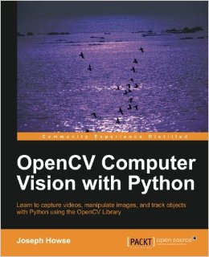
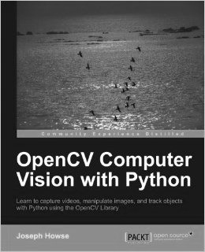

# Grayscale Image Conversion (Manual Average Method)

This Python script converts a color image to grayscale using a manual averaging method. It demonstrates pixel-level manipulation using OpenCV and NumPy.

## What It Does

* Loads an image using OpenCV (`cv2.imread`)
* Converts the image to grayscale by averaging the Red, Green, and Blue (RGB) values for each pixel
* Displays the result using Matplotlib

Note: OpenCV uses BGR format by default, not RGB.

## Common Pitfall

A common issue when averaging RGB values in images is integer overflow. Since image data is typically stored as `uint8` (0–255), adding values directly can exceed this range and wrap around:

```python
gray = (red + green + blue) / 3
```

To avoid this, the script divides each channel separately before summing:

```python
gray = (red/3 + green/3 + blue/3)
```

## How to Use

1. Place an image in the `data/` directory and name it `test.jpg`.
2. Run the script:

```bash
python grayscale_average.py
```

3. The script will display the grayscale image using the average method.

## Dependencies

* `opencv-python`
* `numpy`
* `matplotlib`

Install them with:

```bash
pip install opencv-python numpy matplotlib
```

## Result

The processed images are saved in the `data/` folder:

**Original (`test.jpg`):**



**Grayscale Result (`result.jpg`):**


